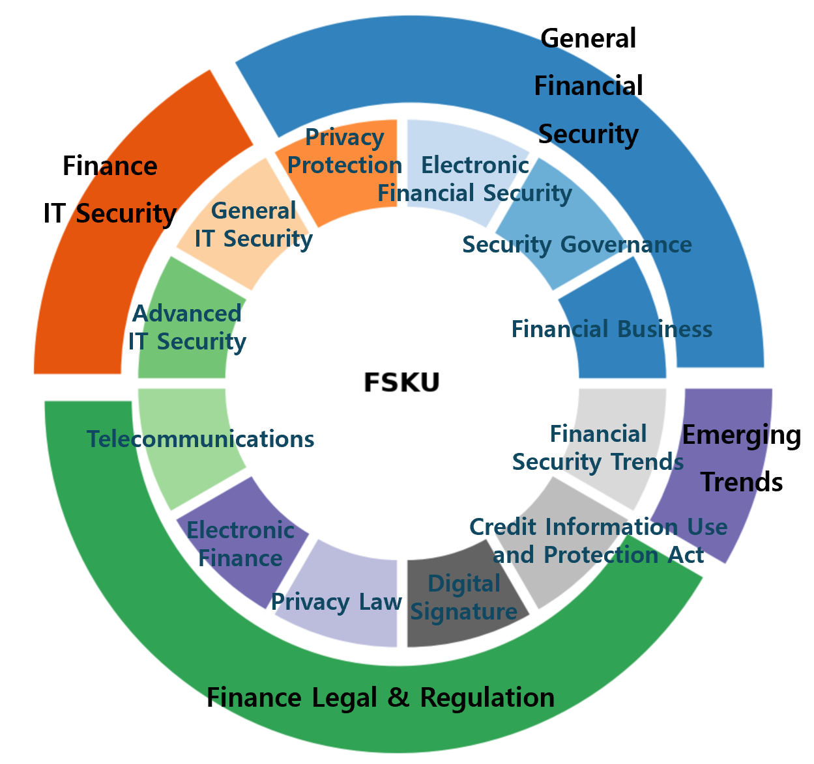

# FSKU: A Benchmark for Financial Security Knowledge Understanding

[](https://opensource.org/licenses/MIT)

**FSKU** is a novel Question-Answering (QA) benchmark designed to measure how well Large Language Models (LLMs) understand the practical, domain-specific knowledge required in the South Korean financial security landscape.

> ### Important Notice
>
> The FSKU benchmark and its related data will be used as an official task for the **2025 Financial AI Challenge (August 1 - August 29, 2025)**.
> [Challenge Page](https://www.fsec.or.kr/bbs/detail?menuNo=66&bbsNo=11704)
>
> Therefore, to ensure the fairness of the competition, detailed information about the benchmark, the full dataset, and the leaderboard scores will be **released after the competition period**.

## Overview

While recent LLMs have demonstrated remarkable capabilities, their proficiency in high-stakes domains like financial security—which requires high reliability for tasks such as fraud detection and regulatory compliance—remains under-explored. As seen in real-world failure cases at the Financial Security Institute (FSI) of South Korea, LLMs can often produce responses that are fluent but factually incorrect, posing significant risks in financial applications.

FSKU was created to address this gap. Based on authoritative sources such as official financial certification textbooks, laws, and supervisory guidelines, FSKU systematically evaluates whether LLMs possess the knowledge required for real-world tasks within financial institutions.

## Features of FSKU

* **Domain-Specific**: FSKU is the first benchmark to focus specifically on financial 'security,' including governance, IT security, regulatory compliance, and emerging threats, rather than general financial knowledge.
* **Grounded in Practice**: The benchmark is highly relevant to industry practice, as it is based on the curriculum of official national certifications like the Financial Security Manager (FSM) and actual laws (e.g., Electronic Financial Transactions Act, Credit Information Use and Protection Act).
* **Rigorous Quality Control**: Drafts were generated using a combination of real-world professional financial security documents and an LLM (GPT-4o). These drafts were then validated and revised by experts from the Financial Security Institute against eight quality criteria to ensure their reliability and validity.
* **Bilingual Support**: All data is provided in both Korean and English, making it accessible to researchers worldwide.
* **Dual Question Types**: The benchmark includes both multiple-choice questions for objective evaluation and subjective questions for assessing deeper understanding and reasoning capabilities.

## Dataset Structure

FSKU provides two types of questions in both Korean and English:

```
FSKU-benchmark/
├── Multiple-Choice Questions
│   ├── test(kor).csv              # Korean 
│   ├── test(eng).csv              # English 
│   └── answer.csv                 # Answer key (numeric only)
│
├── Subjective Questions
│   ├── subjective_test(kor).csv   # Korean 
│   └── subjective_test(eng).csv   # English 
│
├── Code
│   ├── baseline.py                # Baseline inference script
│   ├── evaluate.py                # Evaluation script
│   └── categories.py              # Category definitions
│
└── Documentation
    ├── README.md
    ├── LICENSE
    └── images/
```

### File Formats

| File | Columns | Description |
|:-----|:--------|:------------|
| `test(kor).csv` | Domain, Sub_domain, Question | Multiple-choice questions in Korean |
| `test(eng).csv` | Domain, Sub_domain, Question | Multiple-choice questions in English |
| `answer.csv` | Answer | Correct answer numbers (1-4) |
| `subjective_test(kor).csv` | Question, Answer, Keyword | Subjective questions in Korean |
| `subjective_test(eng).csv` | Question, Answer, Keyword | Subjective questions in English |

## Benchmark Structure

FSKU is hierarchically organized into 4 main domains and 12 sub-domains, allowing for a multi-faceted analysis of a model's performance and the identification of its weaknesses.

| Main Domain                  | Sub-domain (Data Ratio)                                                                                                                                              | Main Sources  |
| :--------------------------- | :------------------------------------------------------------------------------------------------------------------------------------------------------------------- | :------------ |
| **General Financial Security** | Financial Business (5.0%)<br>Security Governance (5.0%)<br>Electronic Security (5.0%)<br>Privacy (5.0%)                                                              | (Undisclosed) |
| **Finance IT Security** | General IT Security (8.0%)<br>Advanced IT Security (12.0%)                                                                                                            | (Undisclosed) |
| **Finance Legal & Regulation** | Electronic Finance (12.0%)<br>Telecommunications (12.0%)<br>Privacy Law (12.0%)<br>Digital Signature (7.0%)<br>Credit Information (12.0%)                                | (Undisclosed) |
| **Emerging Trends** | Financial Security Trends (5.0%)                                                                                                                                     | (Undisclosed) |

*To ensure the fairness of the competition, the main sources will be disclosed after the 2025 Financial AI Challenge.*


*Figure: FSKU Domain and Sub-domain Structure*

## Dataset Examples

### Multiple-Choice Questions

Each item consists of a question, four options, and the correct answer.

| Item         | Content                                                                                                                                                                                                                                                                                                                                                                              |
| :----------- | :----------------------------------------------------------------------------------------------------------------------------------------------------------------------------------------------------------------------------------------------------------------------------------------------------------------------------------------------------------------------------------- |
| **Domain** | Finance IT Security                                                                                                                                                                                                                                                                                                                                                                  |
| **Sub-domain** | Advanced Financial IT Security                                                                                                                                                                                                                                                                                                                                                       |
| **Question** | Which of the following is the most appropriate method to defend against Cross-Site Scripting (XSS) attacks among application security vulnerability countermeasures?                                                                                                                                                                                                                 |
| **Options** | (1) Database encryption<br>(2) Input validation and output encoding<br>(3) Strengthening network firewall settings<br>(4) Enhancing user authentication                                                                                                                                                                                                                               |
| **Answer** | 2                                                                                                                                                                                                                                                                                                                                             |

| Item         | Content                                                                                                                                                                                                                                                                                                                                                  |
| :----------- | :------------------------------------------------------------------------------------------------------------------------------------------------------------------------------------------------------------------------------------------------------------------------------------------------------------------------------------------------------- |
| **Domain** | Financial Security Trends                                                                                                                                                                                                                                                                                                                                |
| **Sub-domain** | Latest Trends in Financial Security                                                                                                                                                                                                                                                                                                                      |
| **Question** | What is the primary function of an SBOM (Software Bill of Materials)?                                                                                                                                                                                                                                                                                    |
| **Options** | (1) To list all components of the S/W supply chain to quickly identify security vulnerabilities.<br>(2) To enhance security by recording all transaction details of a financial company.<br>(3) To automatically fix all errors that occur during the S/W development process.<br>(4) To prevent information leakage by encrypting financial data.            |
| **Answer** | 1                                                                                                                                                                                                                                                                                                           |

### Subjective Questions

Each item consists of a question, a reference answer, and keywords for evaluation.

| Item         | Content (Korean)                                                                                                                                                                                                                                                                                                                                                                              |
| :----------- | :----------------------------------------------------------------------------------------------------------------------------------------------------------------------------------------------------------------------------------------------------------------------------------------------------------------------------------------------------------------------------------- |
| **Question** | 전자금융업자의 자본금 요건이 업무별로 3억에서 20억까지 차등화된 정책적 이유를 설명하세요.                                                                                                                                                                                                                 |
| **Answer** | 업무별 자금 취급 규모와 결제 리스크가 다르기 때문입니다. 직접 자금이체는 리스크가 커 자본금이 높고, PG는 낮습니다.                                                                                                                                                                                                                               |
| **Keyword** | 자본금 차등화                                                                                                                                                                                                                                                                                                      |

| Item         | Content (English)                                                                                                                                                                                                                                                                                                                                                                              |
| :----------- | :----------------------------------------------------------------------------------------------------------------------------------------------------------------------------------------------------------------------------------------------------------------------------------------------------------------------------------------------------------------------------------- |
| **Question** | Explain the policy rationale for differentiating capital requirements for electronic financial service providers (ranging from 300 million to 2 billion KRW).                                                                                                                                                                                                                 |
| **Answer** | This is due to differences in the scale of funds handled and the inherent settlement risks per business type. Direct fund transfers involve higher risks and require higher capital, while PG services have lower requirements.                                                                                                                                                                                                                               |
| **Keyword** | Capital Requirement Differentiation, Risk Management                                                                                                                                                                                                                                                                                                      |

## Leaderboard

The following are the results from an evaluation of 11 representative LLMs. The findings indicate that models generally struggle with the legal and regulatory domains.

The chart below shows the average accuracy across all 11 LLMs for each sub-domain, illustrating the overall difficulty landscape of the benchmark.

| Model | Overall Accuracy | Finance Legal & Regulation | Finance IT Security |
| :--- | :---: | :---: | :---: |
| **claude-4** | (Undisclosed) | (Undisclosed) | (Undisclosed) |
| gpt-4.1 | (Undisclosed) | (Undisclosed) | (Undisclosed) |
| ... | ... | ... | ... |

*To ensure the fairness of the competition, detailed scores will be disclosed after the 2025 Financial AI Challenge.*

## Evaluation Method

### Multiple-Choice Questions

Models are evaluated in a zero-shot setting without fine-tuning. As all questions are multiple-choice with four options, accuracy is measured by extracting the first numerical token from the model's response and comparing it to the correct answer.

### Subjective Questions

Subjective questions are evaluated based on keyword matching and semantic similarity between the model's response and the reference answer. The `Keyword` column provides key terms that should be present in a correct response.

## Running the Evaluation

### Baseline Inference

```bash
# Default: Korean test with beomi/gemma-ko-7b
python baseline.py

# English test
python baseline.py --lang eng

# Custom model
python baseline.py --model "meta-llama/Llama-2-7b"

# Full options
python baseline.py \
    --lang kor \
    --model "beomi/gemma-ko-7b" \
    --output "./my_submission.csv" \
    --max_new_tokens 128 \
    --temperature 0.2
```

#### CLI Options

| Option | Default | Description |
|:-------|:--------|:------------|
| `--lang` | `kor` | Language selection (`kor`, `eng`) |
| `--model` | `beomi/gemma-ko-7b` | Model name or path |
| `--output` | `./baseline_submission.csv` | Output file path |
| `--max_new_tokens` | `128` | Maximum tokens to generate |
| `--temperature` | `0.2` | Sampling temperature |

#### Output Files

- `baseline_submission.csv`: Predicted answers
- `baseline_submission_details.csv`: Detailed results with correctness

### Evaluation

```bash
# Default evaluation
python evaluate.py

# With detailed incorrect predictions
python evaluate.py --verbose

# English test domain evaluation
python evaluate.py --lang eng

# Full options
python evaluate.py \
    --prediction "./my_submission.csv" \
    --answer "./answer.csv" \
    --test "./test(kor).csv" \
    --output "./my_results.csv" \
    --verbose
```

#### CLI Options

| Option | Default | Description |
|:-------|:--------|:------------|
| `--prediction` | `./baseline_submission.csv` | Prediction file path |
| `--answer` | `./answer.csv` | Answer file path |
| `--test` | Auto-detect | Test file for domain evaluation |
| `--lang` | `kor` | Language for auto-detecting test file |
| `--verbose` | `False` | Print detailed incorrect predictions |
| `--output` | `./evaluation_results.csv` | Output file path |

#### Output Files

- `evaluation_results.csv`: Per-question detailed results
- `evaluation_results_by_domain.csv`: Domain/sub-domain level accuracy

#### Sample Output

```
============================================================
FSKU Benchmark Evaluation Report
============================================================
Total Questions: 1108
Correct Answers: 756
Incorrect Answers: 352
============================================================

Domain-Level Evaluation Report
============================================================

[금융보안IT]
  Total: 200 | Correct: 156 | Accuracy: 78.00%
  Sub-domains:
    - 금융IT보안 심화: 75.00% (90/120)
    - 금융IT보안 일반: 82.50% (66/80)
...
```

---

## Subjective Question Evaluation

For subjective (open-ended) questions, we provide separate baseline and evaluation scripts that assess answers based on **semantic similarity** and **keyword matching**.

### Subjective Baseline Inference

```bash
# Default: Korean test
python subjective_baseline.py

# English test
python subjective_baseline.py --lang eng

# Full options
python subjective_baseline.py \
    --lang kor \
    --model "beomi/gemma-ko-7b" \
    --output "./my_subjective_submission.csv" \
    --max_new_tokens 256 \
    --temperature 0.3
```

#### CLI Options

| Option | Default | Description |
|:-------|:--------|:------------|
| `--lang` | `kor` | Language selection (`kor`, `eng`) |
| `--model` | `beomi/gemma-ko-7b` | Model name or path |
| `--output` | `./subjective_submission.csv` | Output file path |
| `--max_new_tokens` | `256` | Maximum tokens to generate |
| `--temperature` | `0.3` | Sampling temperature |

### Subjective Evaluation

The evaluation combines two metrics:
- **Similarity Score**: Semantic similarity between predicted and reference answers (using sentence-transformers)
- **Keyword Score**: Percentage of required keywords present in the prediction

```bash
# Default evaluation
python subjective_evaluate.py

# With detailed results
python subjective_evaluate.py --verbose

# Custom weights (60% similarity, 40% keyword)
python subjective_evaluate.py --similarity_weight 0.6 --keyword_weight 0.4

# Full options
python subjective_evaluate.py \
    --prediction "./my_subjective_submission.csv" \
    --test "./subjective_test(kor).csv" \
    --similarity_model "sentence-transformers/paraphrase-multilingual-MiniLM-L12-v2" \
    --similarity_weight 0.6 \
    --keyword_weight 0.4 \
    --output "./my_subjective_results.csv" \
    --verbose
```

#### CLI Options

| Option | Default | Description |
|:-------|:--------|:------------|
| `--prediction` | `./subjective_submission.csv` | Prediction file path |
| `--test` | Auto-detect | Test file with ground truth |
| `--lang` | `kor` | Language for auto-detecting test file |
| `--similarity_model` | `paraphrase-multilingual-MiniLM-L12-v2` | Sentence similarity model |
| `--similarity_weight` | `0.6` | Weight for similarity score |
| `--keyword_weight` | `0.4` | Weight for keyword score |
| `--output` | `./subjective_evaluation_results.csv` | Output file path |
| `--verbose` | `False` | Print detailed results |

#### Output Files

- `subjective_evaluation_results.csv`: Per-question detailed results
- `subjective_evaluation_results_summary.csv`: Overall metrics summary

#### Sample Output

```
======================================================================
FSKU Subjective Benchmark Evaluation Report
======================================================================
Total Questions: 108

----------------------------------------------------------------------
Average Similarity Score: 0.7234 (72.34%)
----------------------------------------------------------------------
======================================================================

Score Distribution:
----------------------------------------------------------------------
  0.0-0.2: ██ (1)
  0.2-0.4: ████ (2)
  0.4-0.6: ████████████ (6)
  0.6-0.8: ████████████████████████████████████████ (20)
  0.8-1.0: ████████████████████████████████████████████████████████████████████████████████ (79)
```

---

### Requirements

```bash
pip install torch transformers pandas tqdm sentence-transformers
```

## License

This project is licensed under the MIT License - see the [LICENSE](LICENSE) file for details.
